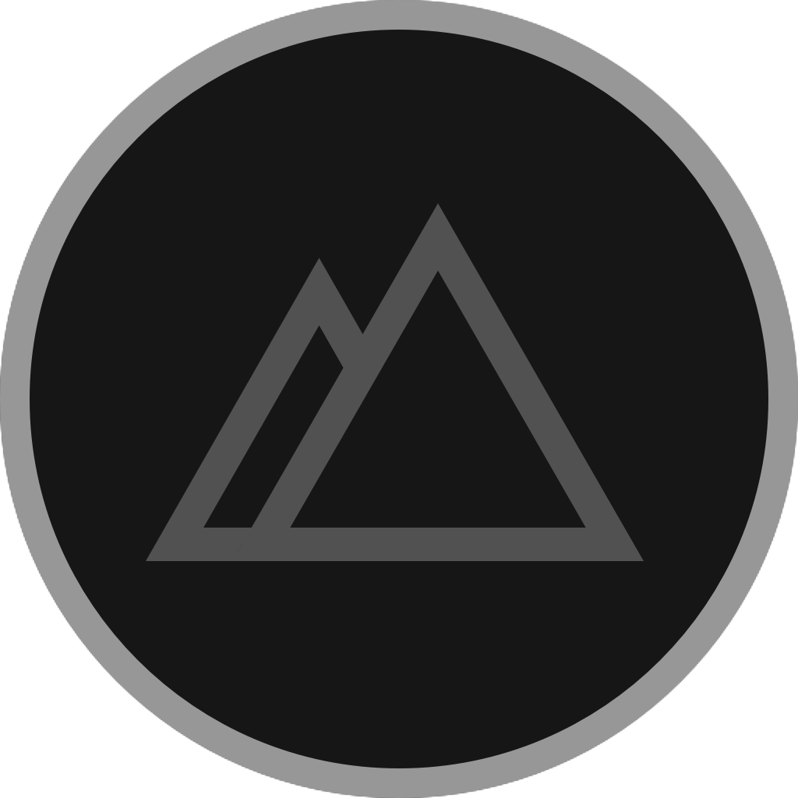
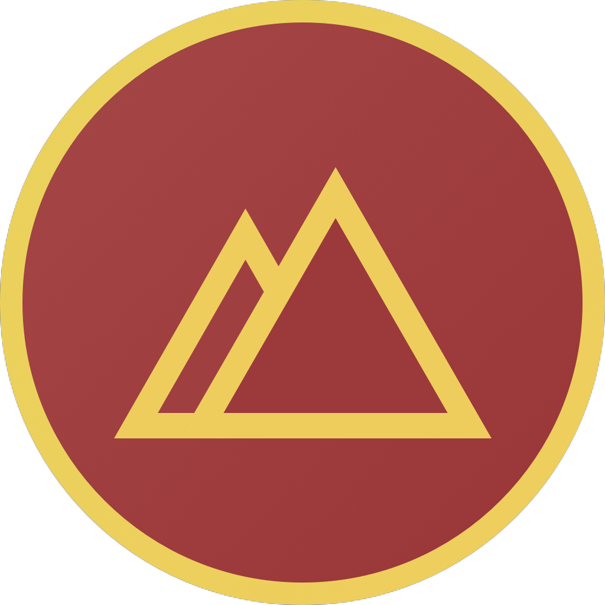
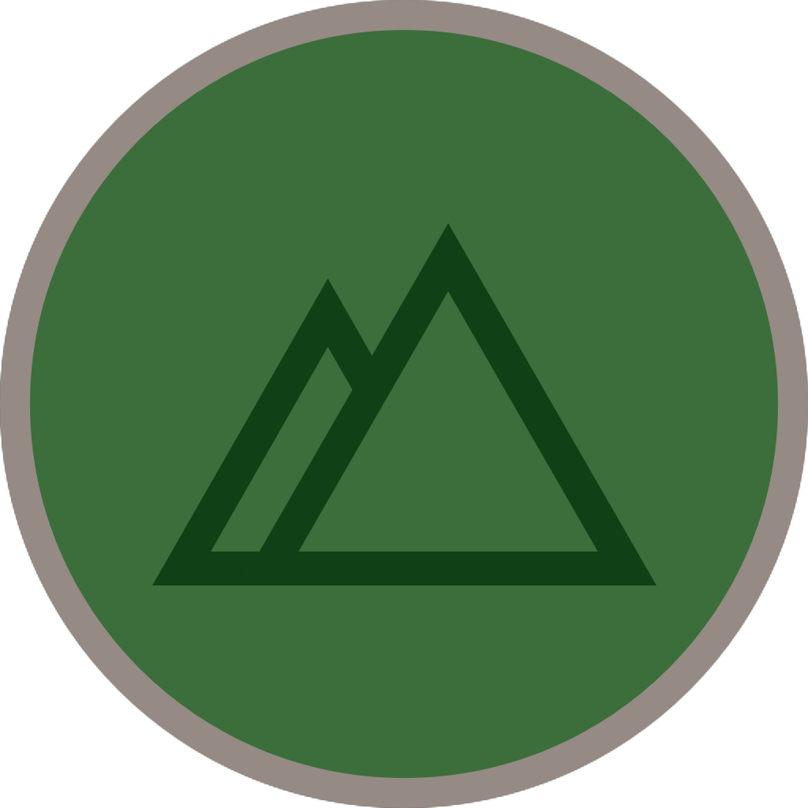
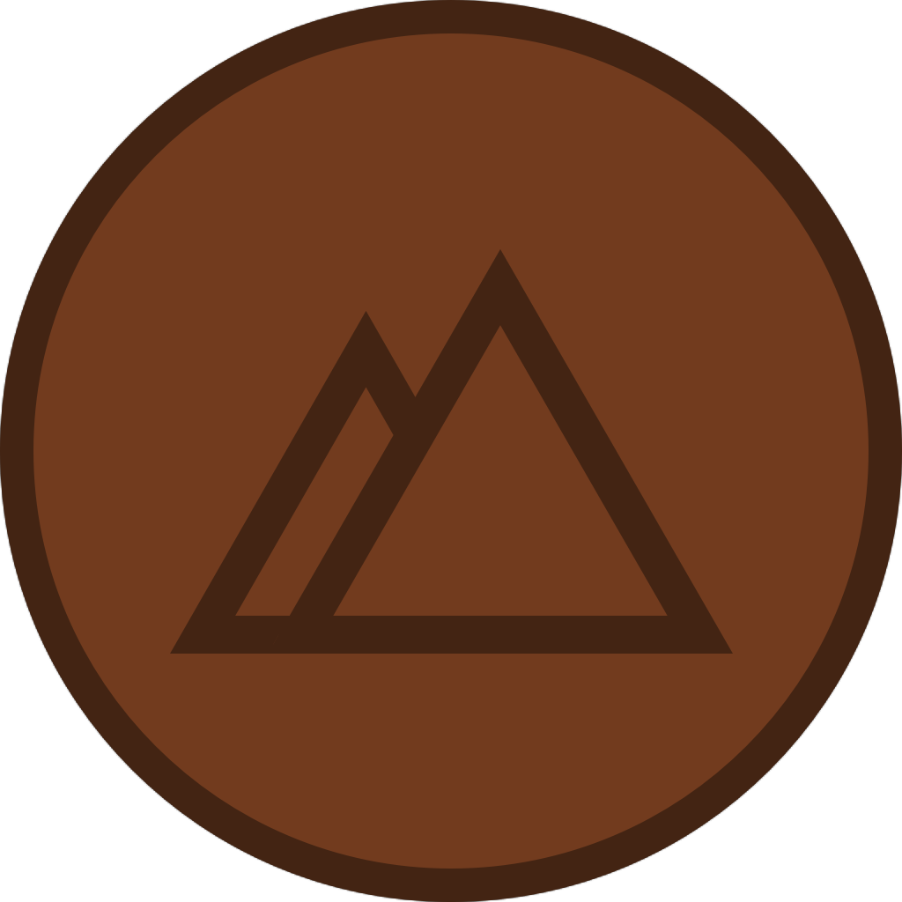
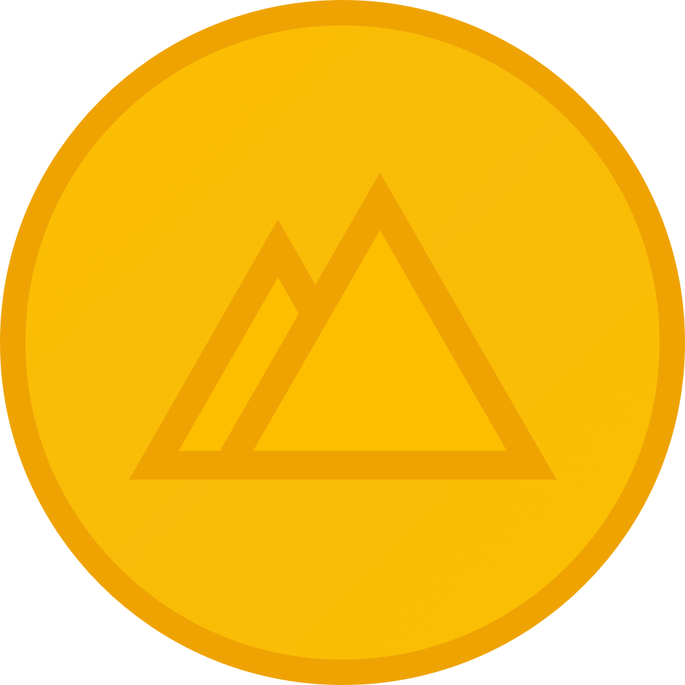
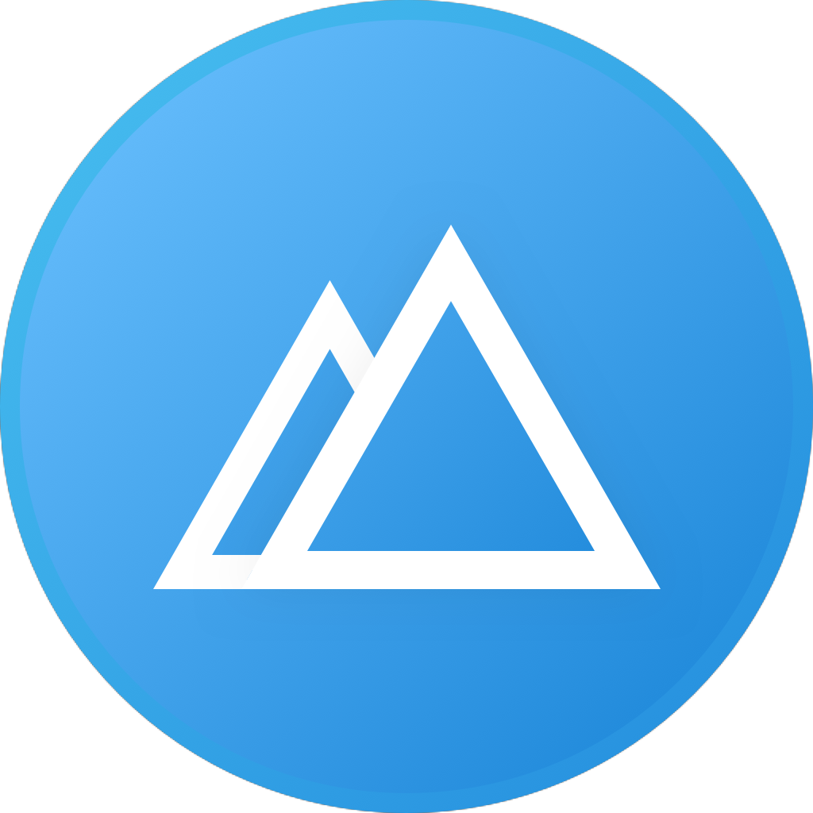
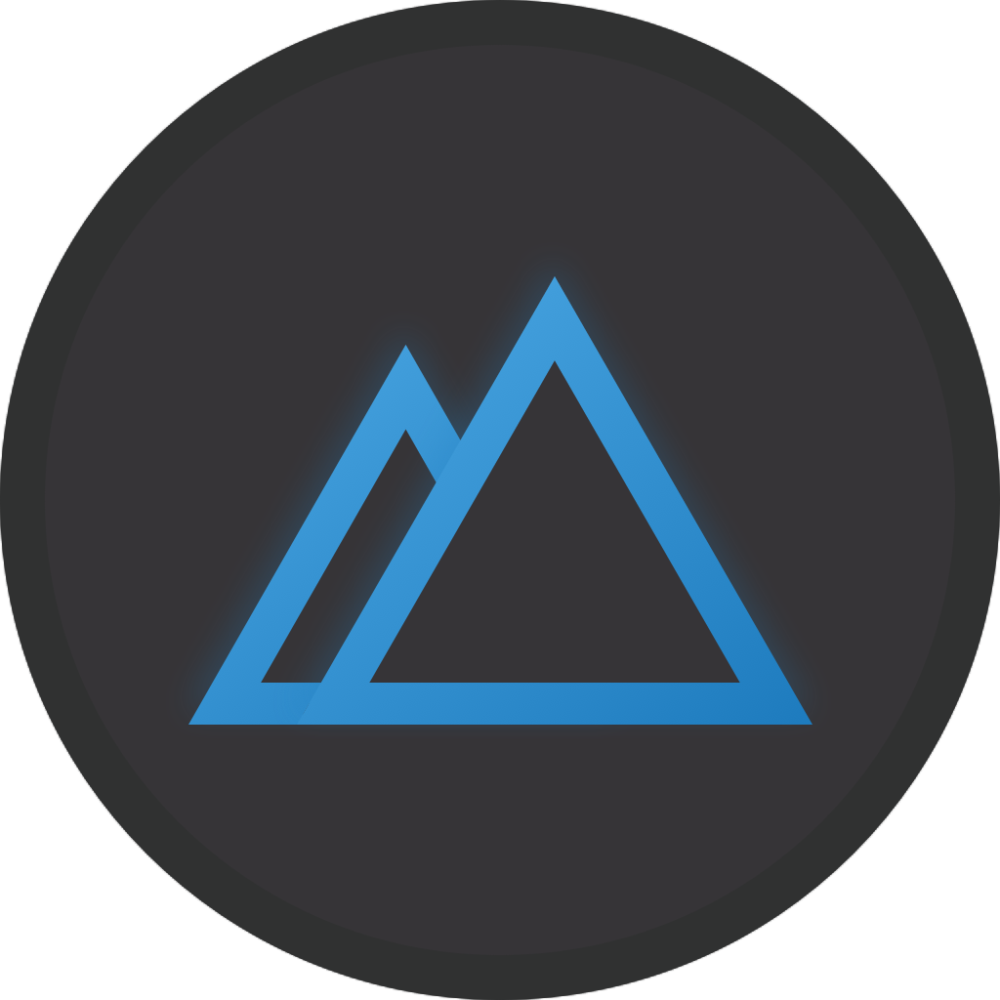
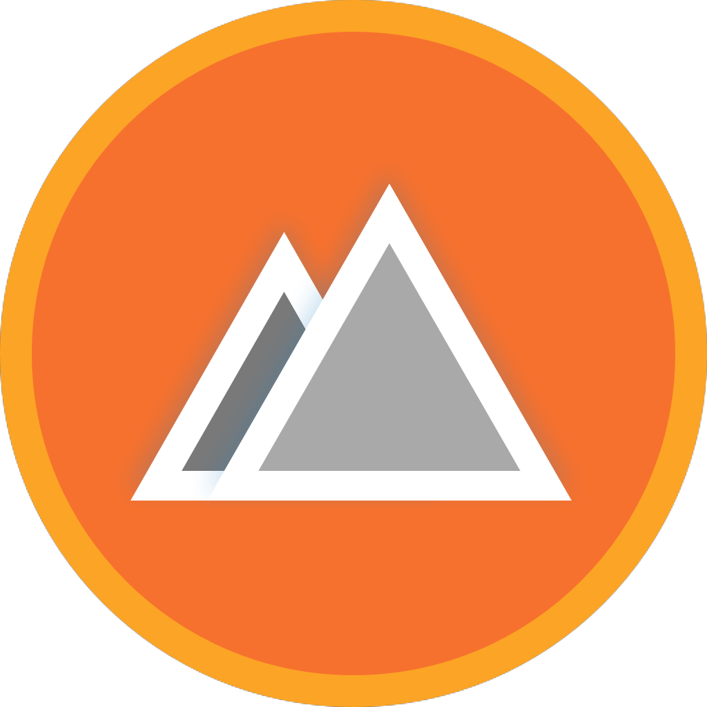

Devslopes App Icons
======================================

```
ALL RIGHTS RESERVED TO THE RESPECTIVE OWNERS OF THE THEMES USED IN THESE ICONS, I OWN NOTHING.

```

## Devslopes
If you don't know what Devslopes is, Devslopes is the best place to learn code, if you want to be a professional iOS Developer, Android Developer, Full Stack Web Developer then Devslopes is the perfect place for you.

## Lifetime access
Devslopes are currently offering lifetime access to all their current and future courses, pay once, learn forever.
This offer ends on Nov 30th click 👉🏼 [here](https://devslopes.com/lifetime-access/) if you want to check it out, I am a lifetime backer myself, I look at this lifetime offer as an investment in my own self.

## Disclaimer
I have no affilition with Devslopes, I am simply a student of Devslopes and I really love what they do, they are the best in the biz. 👌🏼

##

This fun little project for custom [Devslopes](https://devslopes.com/)® platform Icons. All rights reserved to their respective owners of the themes I am using whether it is DC, Marvel, HBO, Netflix or any other app themes.

## How to Install

Copy the `.icns` file you'd like to use (`⌘ + C`). Find Devslopes in your Applications folder, right click the icon and select `Get Info`. Click the icon in the top right corner so that a blue highlight appears around it. `⌘ + V` to paste the new icon in. It may require a restart of Devslopes for the icon to take effect.

If that doesn't work, then dragging the `.icns` to the icon (in the top left) of the info pane, until you see the green plus sign and then dropping it works.

Hovering on them will reveal the names

## Based on my favorite Super Heroes

    

## Based on Star Wars

                

## Based on my favorite TV shows

  

## Based on Developer apps

          


You can find me on Twitter: [@eihabkay](https://twitter.com/eihabkay)
